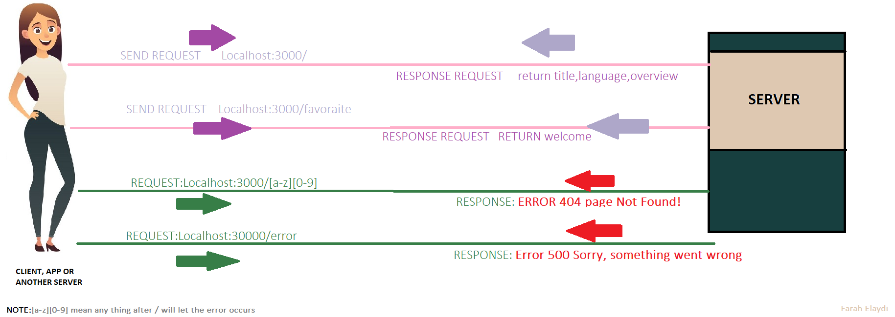

# Movies-Library - 1.0.0

**Author Name**: Farah Elaydi

## WRRC

## Overview

## Getting Started
END POINT : 
> 1-  Localhost:3000/
> 2-  Localhost:3000/favorite/

ERROR : 
> 1-  Localhost:3000/anyEndPoint  ----> **Error404 Page Not Found**
> 2- Localhost:3000/error    ---->  **Error 500 Sorry, something went wrong**

## Project Features
First, we begin by initiating the server and establishing a connection between the server and another entity such as a client, application, or another server. To prevent unnecessary files from being pushed to Git, we utilize the .gitignore file. When downloading the Movies-Library Repository, all you need to do is execute the command "npm install" The package.json file contains all the necessary packages in the dependencies section, so there is no need to install each package individually.