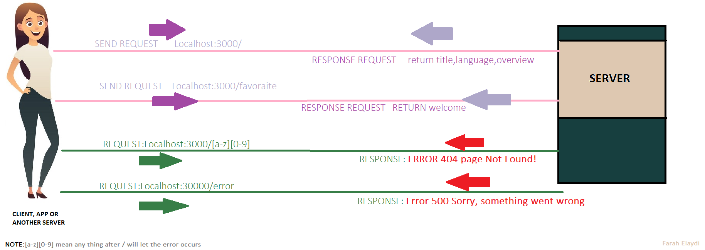
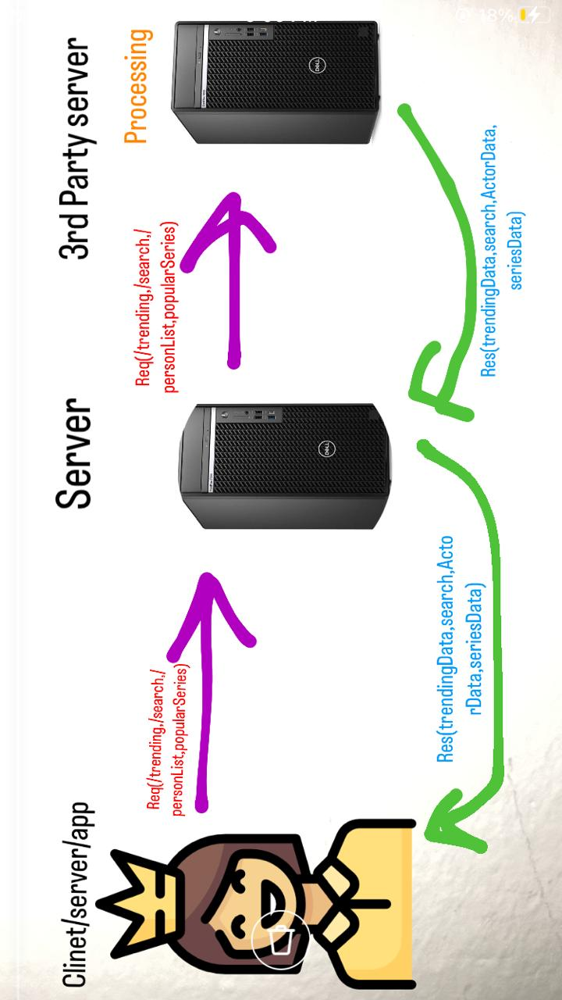

# Movies-Library - 1.0.0

**Author Name**: Farah Elaydi

## WRRC

## Overview

## Getting Started
END POINT : 
> 1-  Localhost:3000/
> 2-  Localhost:3000/favorite/
> 3-  Localhost:3000/trending
> 4-  Localhost:3000/search/title=
> 5-  Localhost:3000/personList
> 6-  Localhost:3000/popularSeries

ERROR : 
> 1-  Localhost:3000/anyEndPoint  ----> **Error404 Page Not Found**
> 2- Localhost:3000/error    ---->  **Error 500 Sorry, something went wrong**

## Project Features
First, we begin by initiating the server and establishing a connection between the server and another entity such as a client, application, or another server. To prevent unnecessary files from being pushed to Git, we utilize the .gitignore file. When downloading the Movies-Library Repository, all you need to do is execute the command "npm install" The package.json file contains all the necessary packages in the dependencies section, so there is no need to install each package individually.

- In today's lab, we learned about using middleware in our server by utilizing the use method. This allows us to incorporate additional functionality and processing for incoming requests. We also explored how to access data from a third-party server by utilizing the axios package. This package enables us to send HTTP requests from our server to the third-party server and retrieve the response. To handle asynchronous operations and avoid blocking the JavaScript code, we made use of async and await. This allows us to wait for a time-consuming function to complete before proceeding with a simpler function, ensuring smooth execution of our code